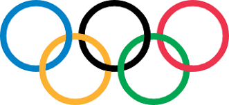

# Olympic Data Analysis System

<p align="center">
  
</p>

## Introduction
The Olympic Data Analysis System is a Python project designed to analyze the performance of countries in the Olympic Games. It provides insights into various metrics such as the number of medals won, the frequency of participation, and more.

## Python Libraries Used


<br>
Pandas is a high-level data manipulation tool developed by Wes McKinney. It is built on the NumPy package and its key data structure is called the DataFrame. DataFrames allow you to store and manipulate tabular data in rows of observations and columns of variables.


<br>
The Matplotlib Python library, developed by John Hunter and many other contributors, is used to create high-quality graphs, charts, and figures. The library is extensive and capable of changing very minute details of a figure.

## Database

<br>
SQL is a domain-specific programming language used for managing relational databases, including querying, inserting, updating, and deleting data, as well as defining and modifying database schemas and controlling access to data.

## Features
- Analyze performance of countries in the Olympics.
- Visualize data using graphs and charts.
- Explore trends and correlations in Olympic data.
- User-friendly interface for easy navigation.

## Installation
1. Clone the repository:
```sh
git clone https://github.com/your_username/Olympic-Data-Analysis.git
```

## Install required libraries:
```sh
pip install pandas matplotlib
```
```sh
pip install pandas pandas
```

### Usage
1. Navigate to the project directory.
2. Run the main Python script:
```sh
python main.py
```
3. Follow the on-screen prompts to interact with the system.

### Contributing
Contributions are welcome! Please fork the repository and submit a pull request with your changes.

### License
This project is licensed under the MIT License - see the [LICENSE](LICENSE) file for details.

### Acknowledgements
- Special thanks to Mrs. Manisha Rajpal for her guidance.
- Thanks to the contributors and users for their feedback and support.
